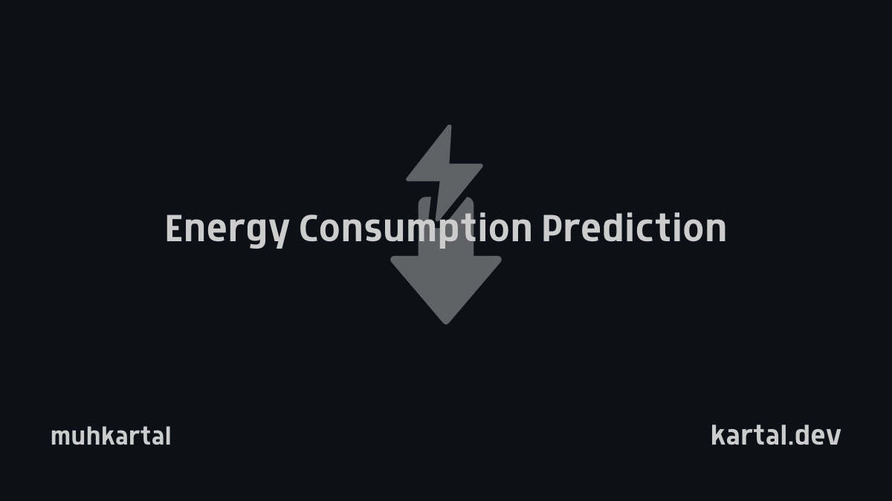

# EV Energy Prediction System

<div align="center">



[](LICENSE)
[](https://www.python.org/)
[](https://github.com/psf/black)
[](docker-compose.yml)
[](CONTRIBUTING.md)

**Advanced machine learning system for accurately predicting energy consumption in electric vehicles**

[Features](#features) | [Installation](#installation) | [Quick Start](#quick-start) | [Documentation](#documentation) | [Contributing](#contributing)

</div>

## Overview

The EV Energy Prediction System is a sophisticated machine learning solution that addresses the critical challenge of accurately predicting energy consumption in electric vehicles. By leveraging state-of-the-art ensemble models and comprehensive feature engineering, the system provides highly reliable energy usage forecasts and range estimations based on diverse factors including driving conditions, weather patterns, route characteristics, and vehicle-specific parameters.

Developed for production deployment, this system helps EV users, fleet operators, and vehicle manufacturers overcome range anxiety through precise predictions that optimize route planning, charging strategies, and overall energy management. The architecture follows MLOps best practices with modular components, ensuring scalability, maintainability, and continuous improvement.

## Features

<table>
  <tr>
    <td width="50%">
      <b>🔮 Precise Prediction Engine</b><br>
      Accurate energy consumption forecasting leveraging ensemble machine learning models that adapt to diverse driving scenarios
    </td>
    <td width="50%">
      <b>🌐 Comprehensive Factor Analysis</b><br>
      Integration of multiple data dimensions including route topology, weather conditions, vehicle specifications, and driving patterns
    </td>
  </tr>
  <tr>
    <td width="50%">
      <b>⚙️ Advanced Model Architecture</b><br>
      Combination of LSTM networks for temporal patterns and XGBoost for complex feature interactions, optimized for accuracy
    </td>
    <td width="50%">
      <b>🔌 Production-Ready API</b><br>
      Robust RESTful API designed for seamless integration with vehicle systems, navigation apps, and fleet management platforms
    </td>
  </tr>
  <tr>
    <td width="50%">
      <b>📊 Interactive Visualization</b><br>
      Comprehensive dashboards and reporting tools for analyzing energy consumption patterns and optimization opportunities
    </td>
    <td width="50%">
      <b>🛠️ Extensible Framework</b><br>
      Modular architecture enabling easy addition of new features, model improvements, and integration capabilities
    </td>
  </tr>
</table>


### Key Components

- **Data Pipeline**: Processes diverse data sources including route information, weather data, and vehicle telemetry
- **Feature Engineering**: Transforms raw data into meaningful features through domain-specific algorithms
- **Model Training**: Implements a systematic approach to model development with validation and hyperparameter optimization
- **Ensemble Model**: Combines multiple algorithms to balance the strengths of different prediction approaches
- **Prediction API**: Provides a robust interface for real-time predictions with appropriate error handling
- **Evaluation & Monitoring**: Ensures continuous model quality through automated testing and performance tracking

## Project Structure

```
├── config/                  # Configuration management
│   └── model_config.yaml    # Model hyperparameters and settings
├── data/                    # Data management
│   └── preprocess.py        # Data preprocessing utilities
├── images/                  # Project images and diagrams
├── models/                  # Model implementations
│   ├── ensemble.py          # Ensemble model architecture
│   ├── lstm_model.py        # LSTM implementation for temporal data
│   ├── train_model.py       # Model training orchestration
│   └── xgboost_model.py     # XGBoost implementation
├── scripts/                 # Utility scripts
│   ├── deploy.sh            # Deployment automation
│   └── train.sh             # Training execution
├── src/                     # Core source code
│   ├── api/                 # API implementation
│   │   ├── main.py          # API entry point
│   │   ├── prediction.py    # Prediction service
│   │   └── schemas.py       # API request/response schemas
│   ├── features/            # Feature engineering
│   │   └── build_features.py # Feature generation and transformation
│   └── visualization/       # Visualization components
│       └── visualize.py     # Visualization utilities
├── test/                    # Comprehensive test suite
│   ├── conftest.py          # Test configurations
│   ├── test_api.py          # API tests
│   └── test_models.py       # Model tests
├── .gitattributes           # Git attributes
├── .gitignore               # Git ignore rules
├── docker-compose.yml       # Docker Compose configuration
├── Dockerfile               # Docker configuration
├── LICENSE                  # License information
├── README.md                # Project documentation
└── requirements.txt         # Dependency management
```

## Quick Start

Get up and running with the EV Energy Prediction System in minutes:

```bash
# Clone the repository
git clone https://github.com/yourusername/ev-energy-prediction.git
cd ev-energy-prediction

# Set up with Docker (recommended for quick start)
docker-compose up -d

# Access the API documentation
open http://localhost:8000/docs
```

## Installation

### Prerequisites

- Python 3.8+
- Docker and Docker Compose (for containerized deployment)
- NVIDIA GPU (recommended for model training)

### Standard Installation

```bash
# Clone the repository
git clone https://github.com/yourusername/ev-energy-prediction.git
cd ev-energy-prediction

# Create and activate virtual environment
python -m venv venv
source venv/bin/activate  # On Windows: venv\Scripts\activate

# Install dependencies
pip install -r requirements.txt

# Verify installation
python -c "from src.api.prediction import predict_energy_consumption; print('Installation successful')"
```

### Docker Installation

For containerized deployment with all dependencies preconfigured:

```bash
# Build and start services
docker-compose up -d

# Verify services are running
docker-compose ps
```

## Documentation

### API Usage

The system provides a RESTful API for energy consumption predictions:

```python
import requests
import json

# API endpoint
url = "http://localhost:8000/api/v1/predict"

# Example request data
payload = {
    "route": {
        "origin": {"lat": 37.7749, "lng": -122.4194},
        "destination": {"lat": 37.3352, "lng": -121.8811},
        "departure_time": "2023-05-10T08:00:00Z"
    },
    "vehicle": {
        "model": "Model Y",
        "year": 2023,
        "battery_capacity": 75.0,
        "efficiency": 0.16
    },
    "weather": {
        "temperature": 18.5,
        "precipitation": 0,
        "wind_speed": 10
    }
}

# Make prediction request
response = requests.post(url, json=payload)
result = response.json()

print(f"Estimated energy consumption: {result['prediction']['energy_kwh']} kWh")
print(f"Estimated range: {result['prediction']['range_km']} km")
```

### API Reference

#### Prediction Endpoint

`POST /api/v1/predict`

**Request Schema:**

| Field | Type | Description |
|-------|------|-------------|
| `route` | Object | Route information including origin, destination, and optional waypoints |
| `vehicle` | Object | Vehicle specifications including model, battery capacity, and efficiency |
| `weather` | Object | Weather conditions including temperature, precipitation, and wind |
| `options` | Object | Optional settings for the prediction request |

**Response Schema:**

| Field | Type | Description |
|-------|------|-------------|
| `prediction` | Object | Prediction results including energy consumption and range |
| `route_details` | Object | Analyzed route information |
| `metadata` | Object | Information about the prediction process |

For complete API documentation, visit the Swagger UI at `/docs` when the server is running.

### Training Models

The system provides tools for training and optimizing prediction models:

```bash
# Run standard training process
./scripts/train.sh

# Run training with custom configuration
python models/train_model.py --config custom_config.yaml --output_dir models/checkpoints
```

## Development

### Development Environment

```bash
# Install development dependencies
pip install -r requirements-dev.txt

# Set up pre-commit hooks
pre-commit install

# Run code formatter
black .
```

### Code Style

This project follows strict coding standards:

- [PEP 8](https://www.python.org/dev/peps/pep-0008/) guidelines for Python code
- Black for consistent code formatting
- Type hints for improved code quality and IDE support

```bash
# Verify code style
flake8 .

# Apply automatic formatting
black .

# Check type hints
mypy src
```

### Testing

The project includes comprehensive tests to ensure code quality:

```bash
# Run all tests
pytest

# Run tests with coverage report
pytest --cov=src --cov=models

# Run specific test modules
pytest test/test_models.py
```

## Deployment

### Docker Deployment

The recommended deployment method uses Docker:

```bash
# Deploy with Docker Compose
docker-compose -f docker-compose.prod.yml up -d

# Scale the prediction service
docker-compose -f docker-compose.prod.yml up -d --scale prediction=3
```

### Manual Deployment

For environments without Docker:

```bash
# Install production dependencies
pip install -r requirements.txt

# Start the API server
gunicorn -w 4 -k uvicorn.workers.UvicornWorker src.api.main:app
```

## Performance

The EV Energy Prediction System delivers reliable performance metrics:

| Metric | Value | Description |
|--------|-------|-------------|
| Prediction Accuracy | ~92-95% | Energy consumption prediction accuracy under varied conditions |
| API Latency | <100ms | Average response time for prediction requests |
| Throughput | 100+ req/s | Requests handled per second per instance |
| GPU Training Time | ~2 hours | Complete model training cycle on recommended hardware |

## Contributing

We welcome contributions to the EV Energy Prediction System! Please follow these steps:

1. Fork the repository
2. Create your feature branch (`git checkout -b feature/amazing-feature`)
3. Run tests to ensure everything works (`pytest`)
4. Commit your changes (`git commit -m 'Add some amazing feature'`)
5. Push to the branch (`git push origin feature/amazing-feature`)
6. Open a Pull Request

For detailed contribution guidelines, see [CONTRIBUTING.md](CONTRIBUTING.md).

### Areas for Contribution

- Enhanced prediction models
- Additional feature engineering approaches
- Improved visualization tools
- Extended API capabilities
- Performance optimizations
- Documentation improvements

## License

This project is licensed under the [MIT License](LICENSE) - see the LICENSE file for details.

## Acknowledgements

- Open-source libraries that power this project:
  - [TensorFlow](https://www.tensorflow.org/) for deep learning capabilities
  - [XGBoost](https://xgboost.readthedocs.io/) for gradient boosting implementation
  - [FastAPI](https://fastapi.tiangolo.com/) for API development
  - [Pandas](https://pandas.pydata.org/) and [NumPy](https://numpy.org/) for data processing
  - [Docker](https://www.docker.com/) for containerization


---
<!-- 
## Contact

-  Project Link: [https://github.com/yourusername/FR-Framework](https://github.com/muhkartal/FR-Framework)
-  Developer Website: [https://kartal.dev/](https://kartal.dev/) -->

---

<div align="center">
<p>If you find E-Forecast helpful, please consider giving it a star ⭐</p>
<p>Muhkartal - kartal.dev</p>
</div>
